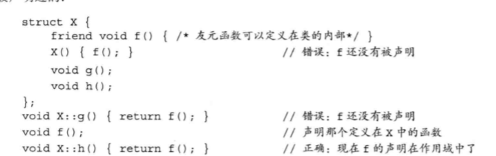
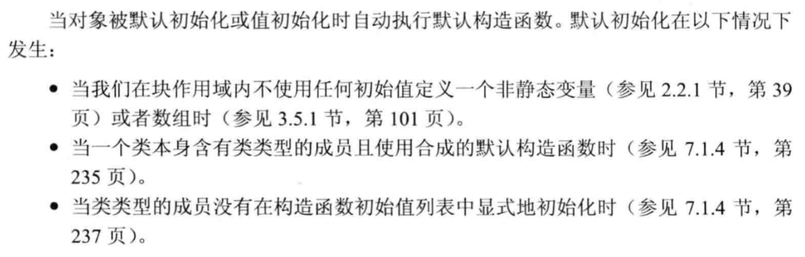
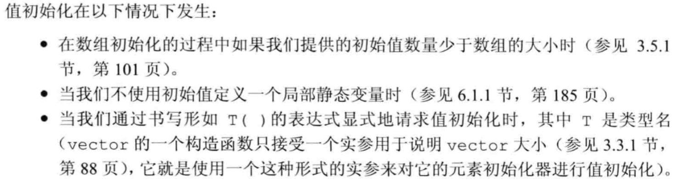

# 定义抽象数据类型
* 定义在类内部的函数是隐式的inline函数

* 类成员函数调用的过程
> 成员函数通过一个名为this的额外的隐式参数来访问调用它的那个对象。

> 当我们调用一个成员函数时，用请求该函数的对象地址初始化this

> total.isbn() <=> Sales_data::isbn(&total)

> 编译器把total的地址传递给isbn的隐式形参this

* this是一个常量指针，不允许改变this中保存的地址

* const成员函数（常量成员函数）
> <font color = Red>成员函数设置为const，作用是修改隐式this指针的类型</font>

> 默认情况下 this指针是常量指针（指针本身是常量，地址不能改变，但是能改变指向内存单元的内容）。类型是 class_type *cont

> this指针需要初始化，this指针并不能绑定到常量对象上（常量对象不能调用成员函数）

> 如果成员函数不改变this指针指向对象的内容，则可以将this指针类型改为const class_type * const。

> <font color = Red> 要注意的是 常量对象及其对象和指针都只能调用常量成员函数</font>

```cpp
#include <iostream>
using namespace std;

class A
{
    public:
        A();

        void test() const {cout<<"test:Ok";}

        void test2()  {cout<<"test2:Ok";}
};


int main(void)
{
    A *a = new A();
    a->test(); //true
    a->test2(); //true

    const A *b = new A();
    b->test(); //true
    b->test2(); //false, const 对象只能调用const成员
    return 0;
}
```

* 类作用域和成员函数
> 对于类的编译，先编译成员的声明，再编译成员函数体

## 构造函数
* <font color = Red> 构造函数不能被声明成const </font>
> 事实上在创建一个const对象时，直到构造函数完成初始化的过程，const对象才能得到常量属性。

> 在构造函数阶段可以在这些对象中写值

### 默认构造函数（合成的默认构造函数）
* 如果成员变量有初始值，则用它来初始化成员,不然使用默认初始化

* <font color = red> 只有当类没有声明任何构造函数时，编译器才会自动地生成默认构造函数</font>
> 如果一个类声明了其他构造函数，那么将没有默认构造函数

* <font color = red> 如果类包含有内置类型或者复合类型的成员，则只有当这些成员全部被赋予了类内的初始值，这个类才适合于使用合成的默认构造函数</font>
>  对于内置类型和复合类型默认初始化的值是未定义的 

* <font color = red>编译器在某些时候无法为某些类合成默认的构造函数</font>
> 当类中包含其他类成员，且该类成员没有默认构造函数，那么编译器无法初始化该成员。

* = default
> 显式生成合成的默认构造函数，使类符合POD类型

> [POD类型](https://blog.csdn.net/kongkongkkk/article/details/77414410)

```cpp
//声明方式
class CLASS_NAME
{
    public:
        CLASS_NAME() = default;
};
```

* 构造函数初始值列表
> 定义在构造函数以及花括号之间，以冒号开始，以逗号隔开，使用成员变量，括号初值 来初始化。

```cpp
//声明方式
CLASSNAME():var1(val1),var2(val2){}
```
* 有的时候必须用带有初始化列表的构造函数
> 1.成员类型是没有默认构造函数的类。若没有提供显式初始化式，则编译器隐式使用成员类型的默认构造函数，若类没有默认构造函数，则编译器尝试使用默认构造函数将会失败。

> 2.const 成员或引用类型的成员。因为 const 对象或引用类型只能初始化，不能对他们赋值。


> [构造函数初始值列表](https://www.runoob.com/w3cnote/cpp-construct-function-initial-list.html)

## 拷贝、赋值和析构
* 编译器会我们的类自动生成上面的默认函数

* 但是对于需要管理动态内存的类通常不能依赖生成的默认函数

* 对于需要管理动态内存的类，建议使用vector或string，可以保证拷贝、赋值和析构函数的使用

# 访问控制和封装
* 访问说明符
> public,private

* class和struct关键字的区别
> 唯一区别是默认的访问权限，class默认是private，struct默认是public

## 友元
* 通过友元可以使其他类或函数访问它的非公有成员，使用方式是在类内以friend关键字进行声明

* 建议在类的开始或结束对友元进行集中声明

```cpp
//声明方式
class CLASS_NAME
{
    friend //函数声明
    friend //类声明

    public:
        //...
    private:
        //...
}
```

* 注意一些编译器来说，友元声明仅仅指定了访问的权限。应该在同一文件中进行友元函数的声明

# 类的其他特性
## 类成员再探
* 自定义某种类型在类中的别名

```cpp
class CLASS_NAME
{
    public:
        typedef std::string::size_type pos1;

    private:
        typedef std::string::size_type pos2;

        pos cursor = 0;
        
}
```

* <font color = Purple> 类内变量取别名，类外无法使用。 </font>

* 如上在类的public中使用别名，则可以进行如下调用

```cpp
CLASS_NAME::pos1 a1; //true
CLASS_NAME::pos2 a2; //false
```

* 内联函数可以在类内声明或类外定义标识一个，也可以都标识。建议在类外定义处标识

### 可变数据成员(mutable)
* 永远不会是const

* 可以声明在const类和const成员函数中，且可以被改变

## 返回*this的成员函数
* 从普通函数返回*this指针是左值

* 从const函数返回*this指针是常量引用，无法继续调用其成员函数

## 类类型
* 两个类即使成员完全一样，也是两个不同的类型

### 类的声明
* 前向声明
> 向程序中引用此类型，并指明该类型是一种类类型

```cpp
//形如
class CLASS_NAME
```

* 当一个类在声明之后，定义之前是一个不完全类型（incomplete type）
> 知道该类是类类型，但是无法知道其内部细节

* 不完全的类型有一下使用场景
> 可以定义指向该类型的指针或者引用

> 可以声明以不完全类型作为参数或者返回类型的函数

* 只要一个类的名字出现后，就被认为是声明过了。所以不完全类型可以有以下用处

```cpp
//声明链表
class Link_screen{
    Screen windows;
    Link_screen *next;
    Link_screen *prev;
};
```

## 友元再探
* 友元关系没有传递性

* 令成员函数作为友元

> 需要指明该成员函数属于哪个类

```cpp
class CLASSA_NAME
{
    friend void CLASSB_NAME::FUNCTION_NAME();
}
```
* 重载函数仍然是不同的函数，声明一组重载函数为友元，必须对所有重载函数进行友元声明

* 继续注意 友元只是一个访问限制符，并不是普通意义上的声明，既然在类内部声明友元并且定义了，使用时，仍需要在类外进行声明，才可以使用



> 当然并不是所有编译器都符合上述原则

# 类的作用域
* 如果在类外函数使用类内的类型，则需要添加域名。因为函数名的类名只是让作用域从类名开始

```cpp
window_mgr::ScreenIndex window_mgr::addScreen(const Screen &s)
```

## 名字查找与类的作用域
* 类编译的顺序
    - 首先，编译成员的声明
    - 知道类全部可见后才编译函数体

* 这样处理只适用于类内成员
> 类内使用非成员，则会按一般情况逐层向外寻找

* 对于普通的作用域，内层声明会隐藏外层声明
    - 对于类类型，类中不能重新定义该名字
> 但是编译器不一定都对此负责

* 访问全局变量
```cpp
::Var_Name
```

# 构造函数再探

## 构造函数初始值列表

* 如果未用初始化列表，则会对相应的成员使用默认初始化

* 如果成员是const、引用，或者属于某种未提供默认构造函数的类类型，我们必须通过构造函数初始值列表为这些成员提供初始值。

### 成员初始化的顺序
* 成员的初始化顺序与它们在类中定义的顺序一致。

* 最好令构造函数初始值的顺序与成员声明的顺序保持一致。而且如果可能的话，尽量避免使用某些成员初始化其他成员。

***

* 如果一个构造函数为所有参数都提供了默认实参，则它实际上也定义了默认的构造函数。

## 委托构造函数

* 委托构造函数
> 一个委托构造函数使用它所属类的其他构造函数执行塔自己的初始化过程，它把它自己的一些（或全部职责）委托给了其他构造函数

```cpp
class  A
{
public:
    A(int aa,int bb ,int cc):a(aa),b(bb),c(cc){}

    A():A(1,2,3){}
    A(int cc):A(1,2,cc){}
    A(double dd):A(){d = dd;}

    void print()
    {
        cout<<a<<" "<<b<<" "<<c<<" "<<d;
    }

private:
    int a;
    int b;
    int c;
    double d;
};
```

### 默认构造函数的作用





### 使用默认构造函数
```cpp
A a(); // 此为定义了一个函数而非对象
A a;   // 默认初始化了一个对象
```

## 隐式的类类型转换
* 转换构造函数
> 能通过一个实参调用的构造函数定义了一条从构造函数的参数类型向类类型隐式转换的规则

```cpp
Sales_data(std::string s) : Sales_data(s,0,0){} // 可以隐式(stirng -> Sales_data)
Sales_data(std::istream &is) : Sales_data(){read(is,*this)} // 可以隐式（cin(istream) -> Sales_data）
```
### 只允许一步类类型转换
* 对其他类型也只会允许一步类型转换

```cpp
Sales_data::combine("99999"); //error char* -> string -> Sales_data
```

* 可以显式隐式混用

```cpp
Sales_data::combine(string("99999"));
Sales_data::combine(Sales_data("9999999"));
```

### 抑制构造函数定义的隐式转换
* 关键字 <font color = red>explicit</font>

* 只能在类内的单个形参的构造函数前使用

* 并且explicit声明的构造函数只能用于直接初始化而不能用于拷贝初始化

```cpp
Sales_data item1(null_book); //true
Sales_data item2 = null_book; //error
```

* explicit 使得构造函数不能用于隐式变换，但仍可以显式变换

```cpp
item.combine(Sales_data(null_book));
item.combine(Static_cast<Sales_data>(cin));
```

## 聚合类

* 聚合类使得用户可以直接访问器成员，并且具有特殊的初始化语法形式

* 集合类要求
> 所有成员都是public

> 没有定义任何构造函数

> 没有类内初始值

> 没有基类也没有virtual函数

```cpp
// 可以使用下列花括号进行初始化
struct Data {
    int val;
    string s;
};

Data val = {"Anna",1024}

```

## 字面值常量类
* 先这么理解，先引用博客

[C++字面值常量类](https://blog.csdn.net/xiangbaohui/article/details/103609122)

# 类的静态成员（static）
* 静态成员变量
> 既可以是public也是private

* 静态成员函数
> 不包含this指针

> 不能声明为const

* 在类外定义静态成员，不用再重复声明static关键字