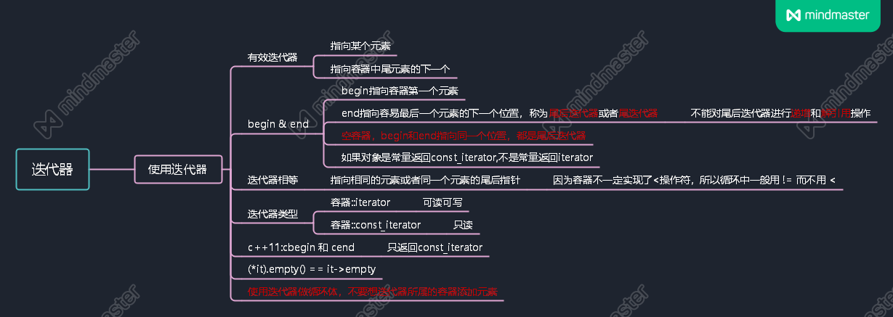

# 命名空间的using声明
* using 声明
```cpp
using std::cin; //尽量使用using声明

using namespace std;//容易造成命名空间命名冲突且不会出现提示,在没有把握的情况下尽量不要用
//https://www.zhihu.com/question/26911239
```

* 不要在头文件中使用using

# 标准库类型 String
## 定义和初始化string对象
* string类型中不包含'\0'

* 拷贝初始化和直接初始化

```cpp
string s1 = "hiya";//拷贝初始化
string s2("hiya");//直接初始化
string s3(n,'c');//直接初始化
```

## string对象上的操作
### 读写string对象
> 忽略开头的空白(空格符、换行符、制表符)等,一直到下一处空白

### 使用getline(stream,string)
* 以换行符为届
* 注意读取流的时候包含换行符，但是存入string中的时候换行符是被丢弃的。

### string::size_type类型
* size_t 可以用auto和decltype推断。
* size_t 是一个无符号数,所以注意不要和int等混用，容易出错

### 字面值和string对象相加
* c++中的字符串字面值不是string对象
* 使用+运算符时,必须保证至少有一层是string对象

## 处理string对象中的字符
* 用于判断字符特性的函数 P82,cctype中

### 使用范围for语句处理每个字符

```cpp
for (declaration : expression)
    statment
```

### 使用范围for语句改变字符串中的字符

```cpp
for(auto &c : string)
    statement
```

### 下标运算符([])
* 下标运算符的下标的类型是size_t，如果传入下标是带符号的则会自动进行类型转换

* 可以将迭代初始值的类型设置为size_t这样保证下标永远大于等于0


# 标准库类型 Vector

* 引用不是对象，所以不存在包含引用的vector

## 定义和初始化vector

### 注意几种特殊的初始化

* 拷贝初始化,一定是用"="
```cpp
string s1 = "hiya";//拷贝初始化
string s2("hiya");//直接初始化
string s3(n,'c');//直接初始化
```

* 提供类内初始值,使用拷贝初始化或者花括号初始化

* 提供初始化元素值列表,一定要用花括号
```cpp
vector<string> v1{"a","an","the"};
```

### vector中的花括号和圆括号

```cpp
vector<int> v1(10); //10个值初始化的元素
vector<int> v2{10}; //1个元素10
vector<int> v3(10,1); //10个元素1
vector<int> v4{10,1}; //1个元素10和1个元素1
```

* 注意花括号首先考虑是列表初始化，然后再考虑构造初始化.

```cpp
vector<string> v5{"hi"}; //1个元素"hi"
vector<string> v6("hi"); //error
vector<string> v7{10}; //10个值初始化的元素
vector<string> v8{10,"hi"}; //10个元素"hi"
```

## 向vector对象中添加元素
* vector::push_back();
* vector对象能高效增长,倾向于初始化空对象再添加元素
* 使用for循环时,不能在vector中添加元素

## 其他vector操作
* 使用vector的size_type需要指定类型

```cpp
vector<int>::size_type //正确
vector::size_type //错误
```

# 迭代器介绍


# 数组
* 数组的大小是固定的

## 定义和初始化
* 数组的大小只能是常量表达式

```cpp
unsigned cnt = 42;
int arr[cnt]; //error

constexpr unsigned sz = 42;
int arr[sz]; //true
```

* 显式初始化
    - 列表初始化可以不指明维数

* 字符数组的特殊性
    - 注意字符数组最后有'/0'
    - 字符串默认隐藏'/0'

* 数组不允许拷贝和赋值

* 复杂数据声明
    - 不存在数组的引用

```cpp
//理解数组的含义，应该从数组的名字开始按照有内向外的顺序阅读

// 含有10个整型指针的数组
int *ptrs[10]; 
// 错误:数组没有引用的数组
// why?暂时理解:引用不占用空间，但需要初始化，但是数组会初始化，分配空间。
int &refs[10] = /*?*/
// 指向 含有10个整型元素的数组
int (*Parray)[10] = &arr;
// 引用 含有10个整型元素的数组
int (&arrRef)[10] = arr;
```

## 指针和数组
* 使用的指针在编译器中一般会把他转换为指针
  
* 取数组名的地址相当于是数组的首地址（第一个元素的地址）

* 用auto推断的数组其实是指针而不是数组

```cpp
int ia[] = {0,1,2,3,4,5,6,7,8,9,0};
auto ia2{ia}; //ia2是指针
```

* decltype推断数组的结果还是相应的

* begin()函数和end()函数可以用于取数组的头指针和尾后指针

* 标准库类型的数组下标只能是无符号整数，而内置数组下标可以是任意整数

```cpp
int *p = &ia[2];
int j = p[1];
int k = p[-2];
```
## c风格的字符串
* c风格字符串不能用<,>,=等来比较大小。应该使用strcmp()

```cpp
const char ca1[] = "A String Sample";
const char ca2[] = "A different String";

if(ca1 < ca2) //不能这么比较，这样比较的意义是ca1和ca2数组的首地址比较大小，无意义。
```

* 拷贝和链接c风格的字符串应使用strcpy()和strcat()

## 与旧代码的接口
### 混用string对象和c风格字符串
* 对于string
    - 可以用c风格字符串初始化string
    - 可以用c风格字符串给string赋值
    - string的符合运算可以和c风格字符串符合

* 对于c风格字符串
    - string转c风格字符串用成员函数 c_str()

### 使用数组初始化vector
* 需要指定初始化数组的首元素地址和尾后元素地址

```cpp
int int_arr[] = {0,1,2,3,4,5};
vector<int> vec(begin(int_arr,end(int_arr)));
```

# 多维数组
* 多维数组其实就是数组的数组

## 使用范围for语句处理多维数组

* 要使用范围for语句，除了最内层的循环外，其他所有循环的控制变量都应该是应用类型。

```cpp
//true
for(const auto &row : ia)
    for(auto col : row)
        cout<<col<<endl;

//false
for(auto row : ia)
    for(auto col : row)
//因为这样的话row会默认将数组变为数组首元素地址,这样内层循环就不合法了
```
## 指针和多维数组
* 多维数组的名字也是首元素的地址（这里的首元素就是首内层数组）

```cpp
//多维数组遍历模板
for(auto p = begin(ia); p != end(ia);++p)
{
    for(auto q = begin(*p); q != end(*p);++q)
    {
        //do sth
    }
}
```