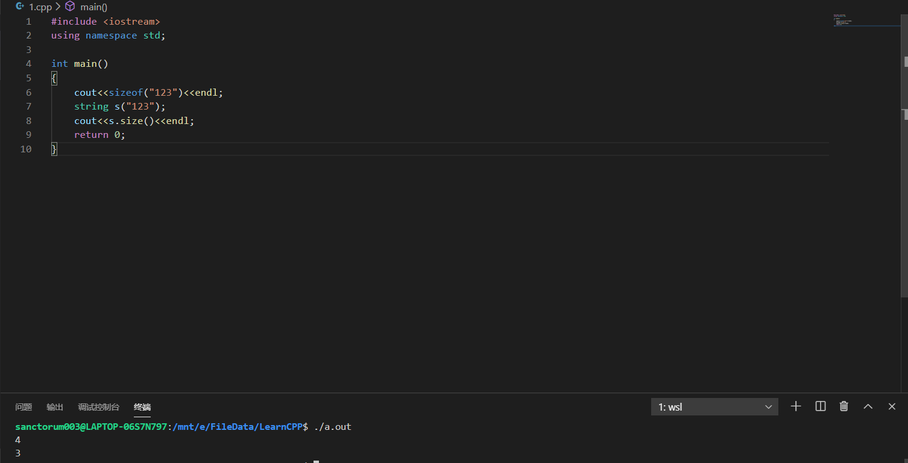

# 基本内置类型
## 算术类型
* 一个char的大小和一个机器字节一样。

* long long >= long >= int >=short

* 字，字节，位
> 一般来说 一个字节占8位，字节是计算机寻址的单位。

> 字是计算机进行数据处理时，一次存取、加工和传送的数据长度称为字（word）。比如32位机，字长为4字节

* float有7个有效位，double有16个有效位
> 证明:待补

* char分为char,unsigned char,signed char
> 但是实际上char为unsigned char和signed char中的一种，具体看编译器的实现。
        
* 使用char时应该明确指定signed char 还是unsigned char，因为不同编译器实现不一样。容易出现问题

* 进行浮点数运算时使用double
> float的精度可能不够，而且double的计算代价与float相差无几

> long double提供的精度一般没有必要而且代价不容忽视

## 类型转换
```cpp
bool b = 42;            //b为true
int i = b;              //i为1
i = 3.14;               //i为3
double pi = i;          //pi为3.0
unsigned char c = -1;   //若char为8bit,c为255
signed char c2 = 256;   //若char为8bit,c2未定义
```

* 无符号数和带符号数相加，先把带符号数转换成无符号数，再相加。 

## 字面值常量
* 十进制字面值的类型是能容下当前值的而且是int,long,long long中最小的。
> 没有short对应的字面值  
> 严格意义上整形字面值没有负数。-42是字面值42再对其取负

* 八进制和十六进制为int,unsigned int,long,unsigned long,long long,unsigned long long中最小的一个。

* 浮点型字母作为小数或科学计数法，默认为double

* 单引号为char型字面量，双引号为字符串型字面量。
> 字符串字面量是含'\0'的，而对于string类型，再C++11标准中也都是'\0'结尾的，具体关于string后讲。  
> 相关测试:   
> 参考网址：https://blog.csdn.net/qq_37037492/article/details/84613381  

> 两个字符串字面值位置相邻且仅有空格缩进和换行符分隔，则它们实际上是一个整体。
```cpp
std::cout<<"A "
           "B";
<=>
std::cout<<"A B";
```

* 布尔值字面量 true false
* 指针字面量 nullptr
## 转义序列
* 泛化转义序列
> 偏门知识点,P36

> "\[][][]" \后面跟0~3位八进制数表示ascii码  
> "\x[]...[]" \后面跟任意位十六进制数表示ascii吗

## 指定字面值类型
### 前缀
类型     | 符号 |  例子   |
-|-|-
char16_t | u | u'\u4e2d' |
char32_t | U | U'\u4e2d' |
wchar_t  | L | L'a'      |
char     | u8| u8"hi!"   |

### 后缀
类型     | 符号 |  例子   |
-|-|-
unsigned    | u/U   | 42ULL      |
float       | f/F   | 1E-3F      |
long        | l/L   | 114514L    |
long double | l/L   | 3.14159L   |
long long   | ll/LL | 42ULL      |

# 变量
* 对象是指一块能存储数据并具有某种类型的内存空间

## 注意：初始化和赋值不一样
* 初始化不是赋值，初始化的含义是创建变量时赋予一个初始值，而赋值的含义是把对象的当前值擦除，而以一个新值来替代。

## 初始化列表
```cpp
//有以下4种初始化的方法
int a = 0;
int a = {0};
int a(0);
int a{0};
```

* 在C++11标准以后，统一使用大括号来初始化列表。
* 大括号与圆括号的区别
> 使用大括号进行列表初始化且初始值存在丢失信息的风险，则编译器将报错

> int a{1.1} 报错  
> int a(1.1) 不报错 a = 1  
> 参考网站：https://bbs.csdn.net/topics/394335237

## 默认初始化
* 对于内置类型，定义在函数体外被初始化为0,定义在函数体内不被初始化

* 未初始化的变量含有一个不确定的值，具有编程风险。建议对所有内置类型进行初始化

## 变量声明和定义
* 声明:使得名字为程序所知。
> 规定变量的类型和名字

* 定义:负责创建与名字关联的实体。
> 规定变量的类型、名字、内存空间、初始值

* 声明一个变量:添加extern关键词，且不要初始化
* 在函数内部使用extern关键词将报错
```cpp
extern int a;//声明
int a;//定义
extern int a = 1;//定义
```
* 变量只能被定义一次，但可以声明多次

* c++ 是静态类型的语言,在编译阶段编译器要检查各个数据类型，判断其是否支持所执行的操作

## 标识符
* 命名要求
> 字母、数字、下划线组成  
> 不能以数字开头  
> 大小写敏感

* 如下要求防止跟标准库重名
> 不能连续两个下划线  
> 不能下划线跟大写字母  
> 函数体外不能下划线开头  

* 命名规范
> 推荐直接看这个：Google 开源项目风格指南 
https://zh-google-styleguide.readthedocs.io/en/latest/

## 名字的作用域
* C++中大多数作用域以花括号分隔。

* 可以使用::(域操作符)来覆盖默认的作用域规则，全局作用没有名字所以左边为空
```cpp
int  a = 2;
int main()
{
    int a  = 1;
    //2 1
    cout<<::a<<" "<<a<<endl;
    return 0;
}
```

# 复合类型
## 引用
* 引用一般指的是左值引用，C++11引入了右值引用
* 定义引用时，程序把引用和它的初始值绑定在一起，而不是将初始值拷贝给引用。一旦初始化完成，引用将和它的初始值对象一直绑定在一起。因为无法令引用重新绑定到另外一个对象，因此引用必须初始化。

```cpp
// 对于这句话，可能会理解偏差。所以接下来举个例子

int b = 1;
int c = 2;
int d = 3;
int &a = b;
cout<<a<<" "<<b<<" "<<c<<" "<<d<<endl;
a = c;
cout<<a<<" "<<b<<" "<<c<<" "<<d<<endl;
a = d;
cout<<a<<" "<<b<<" "<<c<<" "<<d<<endl;

// 结果
// 1 1 2 3
// 2 2 2 3
// 3 3 2 3 

// 可以看到除了一开始的初始化是将引用和它的初始值绑定在一起。之后的"="都说赋值行为
```

* 引用即别名

```cpp
int &a = 10; //错误：必须引用一个对象
double b = 3.14;
int &c = b; //错误：引用类型和绑定对象要求是同一个类型
```

## 指针
* 指针的特点
> (1)指针本身就是一个对象，允许对指针赋值和拷贝  
> (2)指针可以不初始化

* 因为引用不是对象，没有实际地址，所以不能定义指向引用的指针。
```cpp
//引用的指针
//想要看懂声明符ptr的具体类型是什么，最简单的办法就是从右往左读，离变量名最近的符号对其类型有最直接的影响（此处是*，表示其首先是个指针，指针的类型是一个int型引用）。
int a = 20;
int &*ptr = &a;// error

//指针的引用
int a = 20;
int *&b = &a;// ok
```
> 参考网站：https://blog.csdn.net/ck1n9/article/details/79365407  
> 参考网站：https://docs.microsoft.com/zh-cn/cpp/error-messages/compiler-errors-2/compiler-error-c2528?f1url=https%3A%2F%2Fmsdn.microsoft.com%2Fquery%2Fdev15.query%3FappId%3DDev15IDEF1%26l%3DZH-CN%26k%3Dk(C2528)%26rd%3Dtrue&view=vs-2019

* 指针一般要求与所指对象类型严格匹配，例外后讲

* 指针的值（即地址）应属下列4中状态之一：
> 指向一个对象。  
> 指向紧邻对象所占空间的下一个位置。(这个在后面迭代器中会讲)  
> 空指针，意味着指针没有指向任何对象。  
> 无效指针，也就是上述情况之外的其他值。  

* 解引用符 *
> 解引用操作仅适用于哪些确实指向了某个对象的有效指针。所以上述转态的二三四都不适用

### 空指针
* 定义空指针的方式有一下三种,c++11推荐适用nullptr,具体原因看链接
```cpp
int *p1 = 0;
int *p2 = nullptr;
int *p3 = NULL;
```
> 参考网站：https://zhuanlan.zhihu.com/p/79883965

* NULL是预处理变量在c++中就是0，它不属于std,使用时不需要加std::

```cpp
//注意以下错误
int zero = 0;
int *pi = zero; //错误，不能把int变量直接赋值给指针
```

*  void*指针可以存放任意对象的地址，但无法访问其内存空间中所存的对象。

# const限定符
* const必须初始化，不能对带有const的类型执行改变数据的操作
> 猜测：顶层const必须初始化，因为本身不能改变，不初始化根本没法用。而底层const(常量指针)可以不初始化

## 默认情况下，const对象仅在文件内有效
* 在编译时会进行预处理，将代码中所有带const限定符的变量用初始化的常亮替代。

* const对象被设定为仅在文件内有效。当多个文件中出现了同名的const变量时，其实等同在不同文件中分别定义了独立的变量。

* 如果要在多个文件中共享const对象，在需要声明变量的时候前面加extern

## 对const的引用
<span id="对const的引用"></span>
* 别称**常量引用**

* 常量引用可以引用常量和非常量
* 非常量引用不能引用常量

```cpp
const int a = 1;
int  d = 1;

const int &b = a;//true
const int &c = 1;//true
const int &d = d;//true
int &e = a;//false;
```

* 初始化常量引用的时候可以使用任意类型和任意表达式，只要可以转换成相应的引用类型。
> 原因：因为在常量引用绑定初始值的时候，生成了一个临时变量。其事实上绑定的是临时变量。  
> 这样保证了const int&绑定的是int型的表达式
```cpp
double dval = 3.14;
const int &ri = dval;
```
等价于
```cpp
double dval = 3.14;
const int temp = dval;
const int &ri = temp;
```
* 根据上述也可以解释为什么非常量引用不能引用常量，因为这样初始化绑定的是临时量。

## 对const的引用可能引用一个并非const的对象
* const只约束当前绑定的对象的相关操作，而不管对象本身是不是常量。
```cpp
int a  = 1;
int &b = a;
const int &c = a;

b = 1;//true
c = 1;//false
```

## 指针和const
> 对于指针常量和常量指针的定义C++ primer里定义的跟大多数教材不一样
### 指针常量(pointer to const)
* 从右往左读，它是一个指针，是一个指向常量类型的指针。说明不能改变他所指向对象的内容。但是可以改变它指向的对象。
```cpp
const int a = 1;
const int b = 2;
const int *c = &a;
*c = 1;//fasle
c = &b;//true
```

### 常量指针(const pointer)
* 从右往左读，它是一个常量，说明指针的地址不能改变。但是可以改变它指向对象的内容。
```cpp
int a = 1;
int b = 2;
int *const c = &a; 
c= &b;//false
c= 2;//true
```

## 顶层const和底层const
* 顶层const说明指针本身是个常量-常量指针(const pointer)
* 底层const说明指针指向的对象是个常量-指针常量(pointer to const)

### const对拷贝的影响
* 顶层const对拷贝无影响
* 底层const对拷贝有影像
> 拷贝两者有相同的底层const的，或者被拷贝数据可以从非常量转变为常量,才无影响
```cpp
int main()
{   
// 顶层const对拷贝无影响
    {
        // const int -> int  yes
        const int b = 1;
        int a = b;

        // int -> const int yes
        int c = 1;
        const int d = c;
    } 

    // &int(int*) -> int *const/const int*/const int *const
    int a = 1;
    int *const b = &a; //ok
    const int *c = &a; //ok
    const int *const d = &a; //ok

    // &(const int) -> int *const/const int*/const int *const
    const int e = 1;
    int *const f = &e; //error 没有相同的底层const
    const int *g = &e; //ok
    const int *const h = &e; //ok  &e可以转换成const int *const

    //(int cont*) -> int *const/const int*/const int *const
    int i = 1;
    int *const  j= &i;
    int *const  k = j; //ok
    const int*  l = j; //ok
    const int *const m = j; //ok

    return 0;
}
```
* 总结
> 1) 对于非指针类型之间的拷贝,没有限制 const int <-> int

> 2) 对于指针之间的拷贝。右值没有底层const,总合法;右值有底层const,则看左值有没有底层const,有则合法,没有则不合法。   
> * 常量对象不能赋值给非常量引用,常量对象不能赋值给非常量指针

> 3) 对于指针和非指针之间，类型不同不合法;

## constexpr和常量表达式
* 数据类型是常量并且初始值是常量或常量或两者混合的是常量表达式。
```cpp
const int a = 1; //true
const int b = a+1; //true
int c = 1; //false
const int d = get_d(); //false
```

### constexpr变量
* constexpr定义的变量必须要用常量表达式初始化
* constexpr是顶层const，即其本身为常量
* 对于字面量
> 算术类型，引用和指针，字面值常量类，枚举都说字面值  
> 自定义类，IO库，string类等不算字面值

### constexpr 指针
* constexpr指针只能指向地址固定的变量，比如全局变量，staitc变量
```cpp
constexpr int *p1; //顶层const
const int *p2;  //底层const
int *const p3;  //顶层const

constexpr const int *p4;
//<=>
const int *const p5;
```

# 处理类型
## 类型别名
### typedef
```cpp
typedef double wages; //wages是double的别名
typedef wages base,*p;//base是double的别名,p是double*的别名
```

### using
* c++11推荐用一下语法
```cpp
using double = wages; //wages是double的别名
//using 别名 = 类型
```
### 对于符合符合类型的别名的声明语句要小心
```cpp
typedef char *pstring;
const pstring cstr = 0; // pstring是一个整体,是个指向char的指针。const修饰他。所以它本身是一个常量。所以它是常量指针(const pointer)
const char *cstr; //而这里*修饰const char,所以它是指向char常量的指针,即指针常量(pointer to const)
```

## auto类型说明符
* auto用于自动判别变量的类型
* 同一行内的基本类型需要一样
```cpp
auto i =0, PI = 3.14 //wrong
```

### auto声明，忽略顶层const，不忽略底层const
```cpp
const int ci = i,&cr = ci;
auto b = ci; //b is int
auto c = cr; //c is int
auto d = &i; //d is pointer to int
auto e = &ci;//e is pointer to const int
```

### 声明顶层const的auto类型
```cpp
const auto f = 0;
```

### auto的引用
* 规则与引用的一致  

[对const的引用](#对const的引用)

```cpp
auto &g = ci; //true,因为auto会考虑到底层const， g is reference to const
auto &h = 42; //wrong,不能为非常量引用绑定字面值
const auto &j =42;//true,可以为常量引用绑定字面值
```
```cpp
int i = 0;
const int ci = i;

auto k = ci,&l = i;
auto &m = ci,*p = &ci;
auto &n = i,*p2=&ci; //注意上面说的auto同一行内的右值要类型相同
```

### Exercise 2.35

> Determine the types deduced in each of the following definitions. Once you’ve figured out the types, write a program to see whether you were correct.
>
> ```cpp
> const int i = 42;
> auto j = i;
> const auto &k = i;
> auto *p = &i;
> const auto j2 = i, &k2 = i;
> ```

- `i` is `const int`.
- `j` is `int`.
> auto 忽略顶层const
- `k` is `const int&`.
- `p` is `const int *`.
> k和p需要考虑auto不忽略顶层const
- `j2` is `const int`.
- `k2` is `const int&`.

## decltype
* decltype 用于选择并返回操作数的数据类型
> 只推断类型，不计算表达式的值

> decltype能返回包括顶层const和引用在内的类型
```cpp
const int ci = 0,&cj = ci;
decltype(ci) x = 0; // x is const int
decltype(cj) y = x; // y is const int&,并初始化绑定x
decltype(cj) z;     // wrong 引用必须初始化
```

* decltype与引用
```cpp
int i = 42,*p=&i,&r=i;

decltype(r)  //int&
decltype(r+0) //int
decltype(*p) //int&
```

* decltype((variable))的结果永远是引用，而decltype(variable)的结果只有当variable本身就是一个引用的时候才是引用。

# 自定义数据结构
## 头文件保护符
* #ifdef 定义为真,未定义为假
* #ifndef 定义为假，未定义为真
* 需使用#define来定义

```cpp
//使用方法
#ifndef SALES_DATA_H
#define SALES_DATA_H

//code

#endif
```