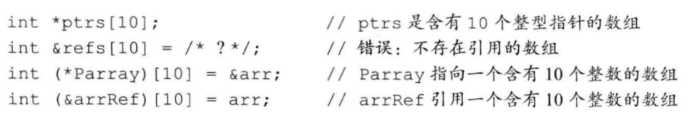
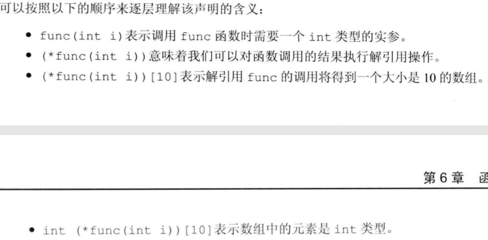
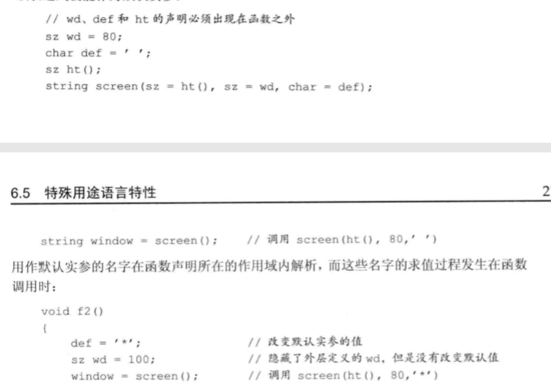
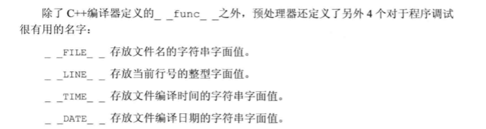
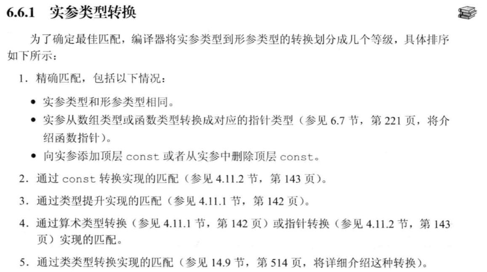

# 函数基础

## 函数返回类型

* 返回类型不能是数组类型或者函数类型，但是可以是指向数组或者函数的指针.

# 局部对象

* 名字的作用域

  - 名字的作用域是程序文本的一部分，名字在其中可见

* 对象的生命周期  
  
  - 对象的生命周期是程序执行过程中该对象存在的一段时间。

* 自动对象

  - 只存在于块执行期间的对象称为自动对象，当块的执行结束后，块中创建的自动独享的值就会变成未定义的了

  - 自动对象未指定初值，则会默认初始化，初始值为未定义的值。

* 局部静态对象

  - 在程序的执行路径第一次经过对象定义时初始化，并且直到程序终止才销毁。

## 函数声明

* 函数只能定义一次，但是能声明多次

* 函数声明 == 函数原型

# 参数传递

* 形参初始化的机理与变量初始化一样

* 引用传递：形参将绑定到对应的实参上。

* 值传递：将实参的值拷贝后赋值给形参

## 传值参数
*  对形参的操作不会影响实参

* 指针形参
  - 拷贝的是指针，但是可以通过指针来更改所指对象的内容

## 引用参数
* 使用引用避免拷贝
  - 尽量使用引用参数,对于不需要改变实参的时候，可以使用常量引用

## const形参和实参
* const int i 和int i不能成为重载函数

## 数组形参
* 不允许拷贝数组
* 数组在参数传递时会转换成指针

### 管理指针形参的方法，
* 使用标记指定数组长度
  - 给指针数组提供一个结束标记，比如char*的'\0'结束标记

* 使用标准库规范
  - 提供一个指针数组的首尾指针，迭代知道首尾指针重合

* 显式传递一个表示数组大小的形参

***



## main:处理命令行选项
```cpp
int main(int argc,char **argv)
//argc:命令行参数的个数，
//argv:命令行参数字符串,argv[0]为程序名
```

## 含有可变（数量）形参的函数

* [使用方法](https://blog.csdn.net/Clark_Sev/article/details/89500808?utm_medium=distribute.pc_relevant.none-task-blog-BlogCommendFromMachineLearnPai2-1.channel_param&depth_1-utm_source=distribute.pc_relevant.none-task-blog-BlogCommendFromMachineLearnPai2-1.channel_param) 

* initializer_list 标准库类型
    - 成员永远是常量 
    - 传递参数的时候用花括号括起来
* 可变参模板
    - 见16.4
* 省略符形参
    - 应该只用在c和c++通用的类型，不适用于大多数类类型

# 返回类型和return语句
## 无返回值的函数
## 有返回值的函数
* 返回值是在该函数中创建的临时变量。
* 不要返回局部对象的引用或指针。

### 引用返回左值
* 函数的返回类型决定函数调用是否是左值
  - 调用一个调用返回引用的函数得到左值
  - 其他返回类型得到左值

* 通过这种方式就可以多次调用函数和使用运算符
```cpp
auto sz = shorterString(s1,s2).size()

//还要注意返回类型是常量的引用，也不能给调用的结果赋值
shorterString("hi","bye") = "X" //false
```
```cpp
char get_val(string &str,string::size_type ix)
{
    return str[ix];
}

int main()
{
    string s("a value");
    cout<<s<<endl;
    get_val(s,0) = 'A';
    cout<<s<<endl;
    return 0;
}
```

### 列表初始化返回值
* 函数可以返回花括号包围的值的列表。
  - 内置类型，列表中做多包含一个值
  - 类类型，有类本身定义初始值如何使用

### 主函数返回值
* cstdlib中有与机器无关的预定义变量表示各类错误信息，如
  - EXIT_FAILURE
  - EXIT_SUCCESS

### 声明一个返回数组指针的函数
* 一般方式
> Type (*function(parameter_list))[dimension]



* 使用类型别名
```cpp
typedef int arrT[10];
using arrT = int[10];
arrT* func(int i);
```
> arrT是含有10个整数的数组的别名

> 函数返回的是包含10个整数的数组的指针（二维数组）

* 使用尾置返回类型
> auto func(int i ) -> int(*)[10];

* 使用decltype
> decltype不负责把数组类型转换成指针，需要自己加上*

# 函数重载
* main函数不能重载

* 以下情况不能为重载函数
  - 除返回类型外，其他要素一样
  - 两个形参类型看起来不一样，实际是一样的
    - 形参名字不同或省略形参名字

* 顶层const不能作为重载函数,底层const可以用于重载函数

```cpp
//顶层const
Record lookup(Phone);
Record lookup(const Phone);

Record lookup(Phone*);
Record lookup(Phone* const);

//底层const
Record lookup(Account&);
Record lookup(const Account&);

Record lookup(Account*);
Record lookup(const Account*);
```

* const_cast 和 重载

* 重载函数调用匹配规则
> 编译器找到一个与实参最佳匹配的函数，调用该函数

> 找不到任何一个函数与调用实参匹配，发出无匹配错误

> 有多于一个可以匹配，但是每一个都不是明显的最佳选择。此时也将发生错误，称为二义性调用。

## 重载和作用域
* 内层作用域中的声明会隐藏外层作用域中声明的同名实体
> 是直接调用不了外层同名实体，不管是声明函数还是变量。

# 特殊用途语言特性
## 默认实参
### 调用
* 如果一个形参有了默认实参，其后面的参数都需要有默认实参

* 默认实参是能自动添补缺少的尾部实参，不能在首部省略实参

### 声明
* 函数可以多次声明，但默认单个形参的默认实参只能赋值一次，并且满足尾部全是默认实参。
> 即第一次赋值了某一些默认实参，第二次不能改变第一次赋值的默认实参，但是可以在满足尾部全是默认实参的情况下，赋值其他默认实参。

### 初始值
* 局部变量不能作为默认实参，其他均可。



## 内联函数和constexpr
### 内联函数可以避免函数调用的开销
* inline

### constexpr函数
* 要求
  - 返回值和所有形参的类型都是字面值类型
  - 有且只有一条return语句
  - 运行时不执行任何操作

* constexpr被隐式的指定为内联函数

* 可以返回非常量
> 可以返回常量之间的运算结果

***

* 内乱函数和constexpr函数一般放于头文件中

### 调试帮助
#### assert预处理宏
* 由预处理器管理，可以直接使用
> 无需std或using声明

#### NDEBUG预处理变量
* NDEBUG可以决定assert是否启用。但是注意要定义在assert声明之前。具体看以下连接
> https://www.zhihu.com/question/23075111

* 一些局部静态变量，可以用于调试


# 函数匹配
* 确定候选函数和可行函数
  - 与被调用的函数同名
  - 其声明在调用点可见

* 寻找最佳匹配
  - 该函数每个实参的匹配都不劣于其他可行函数需要的匹配
  - 至少有一个实参的匹配优于其他可行函数提供的匹配

## 实参类型转换



# 函数指针
* 类型
  - 函数的类型由它的返回类型和形参类型共同决定，与函数名无关

* 声明
  - return_type (*p)(parameter_list)

* 使用函数指针
  - 赋值的取地址符可选
  - 调用的解引用符可选
  - = 0 或者 = NULL 表示不指向任何函数
  - 赋值需要返回类型和形参列表匹配

* 重载函数的指针
  - 定义的时候必须和其中某一个重载函数匹配

## 函数指针形参
* 形参不能是函数，但是可以是指向函数的指针。

```cpp
//形如:(二者等价)
void useBigger(const string &s1,const string &s2, bool pf(const string &,const string &))

void useBigger(const string &s1,const string &s2, bool (*pf)(const string &,const string &))
```

* 可以使用类型别名进行简化
```cpp
typedef bool Func(const string& ,const string&) // 将bool(const string& ,const string&)用Func表示
typedef decltype(lengthCompare) Func2;

typedef bool (*FuncP)(const string& ,const string&) // 将bool(*)(const string& ,const string&)用Func表示
typedef decltype(lengthCompare) *FuncP2;

```
> 注意 Func和Func2是函数类型

> FuncP和FuncP2是指向函数的指针，<font color=red>注意decltype不能直接解析出指针类型，所以decltype的结果需要加上*</font>

> 但是函数类型可以直接用作指向函数的指针，但是上述的注意点还是得留意

## 返回指向函数的指针
* 使用类型别名
  - <font  color=blue>注意编译器在返回类型的时候不会自动把函数类型变为指针类型，所以返回类型必须写成指向函数的指针类型</font>

```cpp
//例如
using PF = int(*)(int*,int);
PF fl(int);

using F = int(int*,int);
F* fl(int)
```

* 一般形式
```cpp
int (*f1(int))(int*,int);
```

* 使用尾置返回类型
```cpp
auto f1(int) -> int(*)(int*,int)
```

## 将auto和decltype用于函数指针类型
* 注意点还是decltype返回的是函数类型不是指向函数的指针类型。


